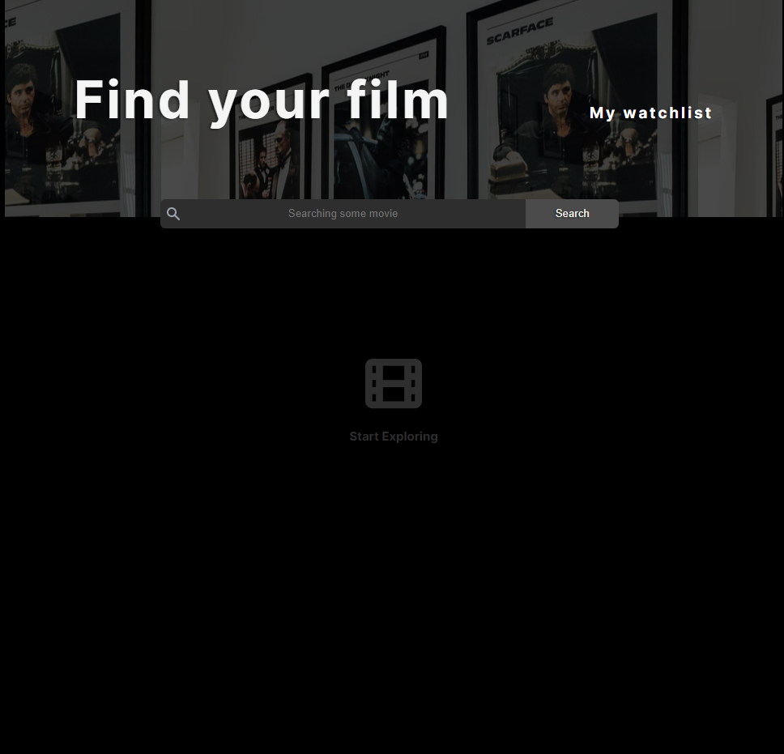
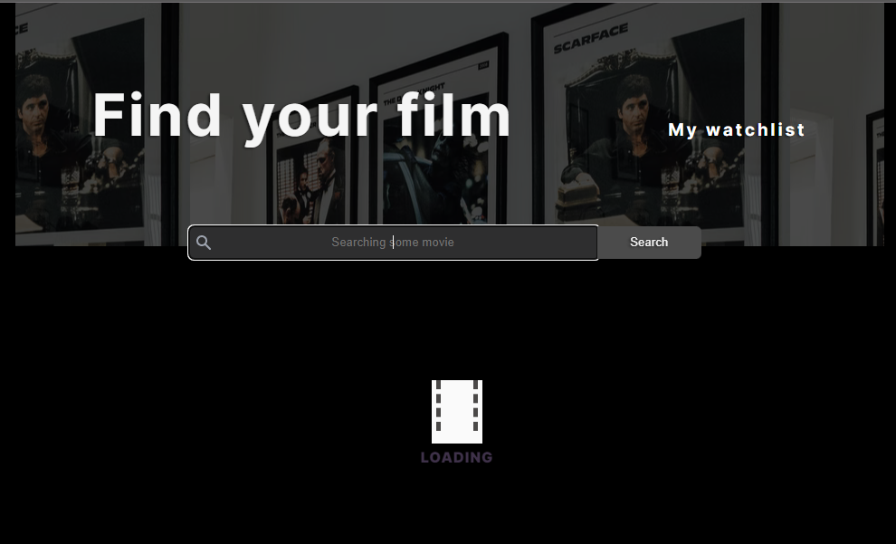
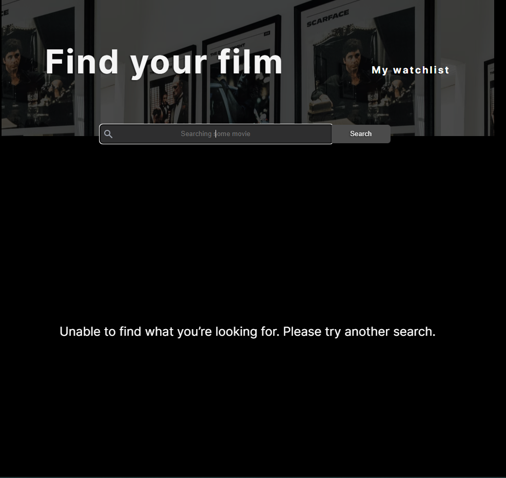
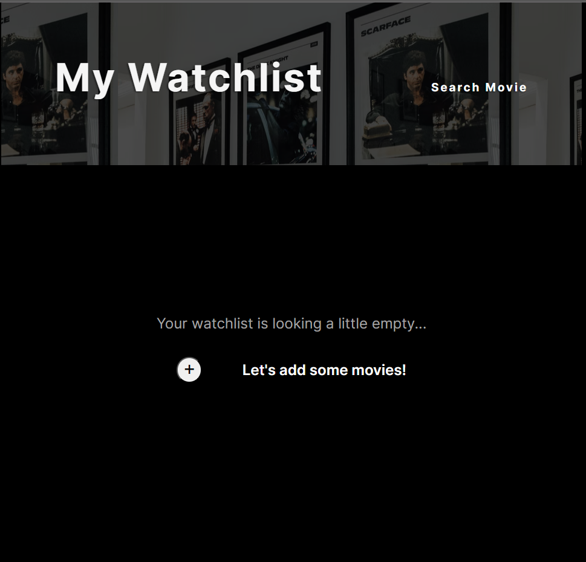
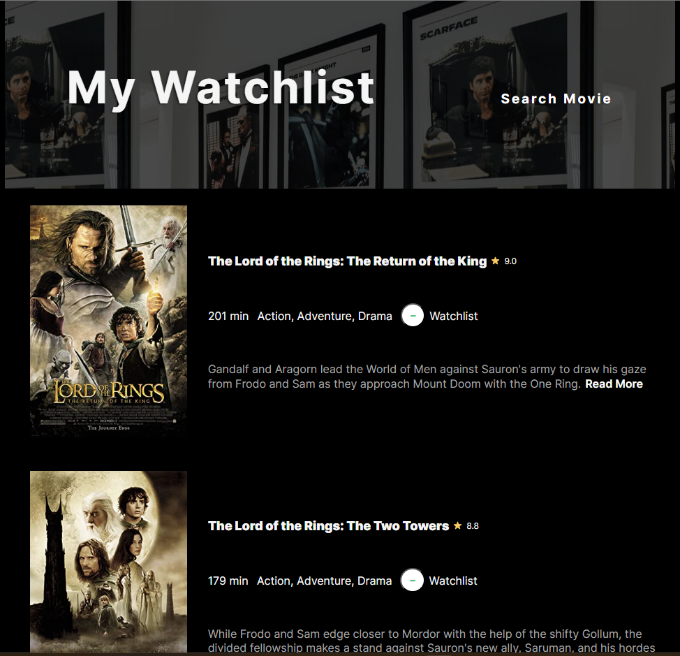

# Movie List App

This is a simple movie listing application. The user provides the movie they want to watch or add to their watchlist as input to the application. The API used to list the movies in the application is called OMDBApi.

## TABLE OF CONTENTS

- [Overview](#overview)
  - [Screenshot](#screenshot)
  - [Links](#links)
- [Process](#process)
  - [Overview](#process-overview)
- [Built With](#built-with)

## [Overview](#overview)

Users are allowed to:

- select the movie from search input
- add watchlist movie and remove watchlist movie

## [Screenshots](#screenshot)

### Search Movie Screen

### Loading Screen

### Errors Screen

### Watchlist Screen

## [Links](#links)

[OMDb API](https://www.omdbapi.com/)

## [Overview](#process-overview)

## [Built With](#built-with)

- Asynchronous JavaScript
- Semantic HTML5 markup
- Flexbox
